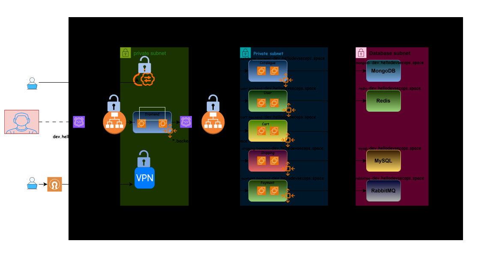

<h1>Roboshop VM Architecture</h1>


# Ansible RoboShop Roles

Ansible configuration management for the [RoboShop](https://github.com/Sangala632/roboshop-aws-infra) e-commerce application. This repository contains roles that install and configure every microservice and database that makes up the platform. It is designed to be called from the [Terraform infrastructure repo](https://github.com/Sangala632/roboshop-aws-infra) as part of the golden AMI build process — Terraform provisions the EC2 instance, runs the relevant Ansible role via a bootstrap script, stops and snapshots the instance, then terminates it.

**Repository:** https://github.com/Sangala632/ansible-roboshop-roles-tf  
**Infrastructure repo:** https://github.com/Sangala632/roboshop-aws-infra

---

## How It Works

Each microservice playbook runs on `localhost` using a local connection. This is intentional — Ansible is not called remotely from a control node. Instead it runs directly on the EC2 instance being baked into a golden AMI:

```
Terraform (roboshop-aws-infra)
  │
  ├─ Launches EC2 instance
  ├─ Copies bootstrap.sh to instance
  ├─ SSH remote-exec: runs bootstrap.sh
  │     └─ bootstrap.sh calls:
  │           ansible-pull / ansible-playbook main.yaml -e component=<name> -e env=<env>
  │
  ├─ Stops instance
  ├─ Creates AMI snapshot
  └─ Terminates instance → Launch Template → ASG
```

The `main.yaml` playbook dynamically loads the role matching the `component` variable, so a single playbook file handles all services:

```yaml
- name: "configure {{ component }}"
  hosts: localhost
  connection: local
  roles:
    - "{{ component }}"
```

---

## Repository Structure

```
ansible-roboshop-roles-tf/
├── main.yaml               # Universal playbook — accepts component= and env= variables
├── mongodb.yaml            # Standalone playbook for MongoDB (runs against mongodb host group)
├── mysql.yaml              # Standalone playbook for MySQL
├── inventory.ini           # Static inventory mapping hostnames to component groups
├── hosts.yaml              # (empty — dynamic inventory placeholder)
└── roles/
    ├── common/             # Shared tasks imported by all service roles
    │   └── tasks/
    │       ├── app-setup.yaml    # Create /app dir, roboshop user, download & unzip artifact
    │       ├── nodejs.yaml       # Install Node.js 20 and npm dependencies
    │       ├── python.yaml       # Install Python 3, gcc, pip dependencies
    │       ├── maven.yaml        # Install Maven + MySQL client, build JAR
    │       ├── systemd.yaml      # Deploy systemd service, reload daemon, enable & start
    │       └── deployment.yaml   # Zero-downtime redeploy: stop → wipe → download → restart
    ├── catalogue/          # Node.js — product catalogue (MongoDB)
    ├── cart/               # Node.js — shopping cart (Redis + Catalogue)
    ├── user/               # Node.js — user accounts (MongoDB + Redis)
    ├── payment/            # Python (uWSGI) — payment processing (Cart + User + RabbitMQ)
    ├── shipping/           # Java (Maven) — shipping + city data (MySQL)
    ├── frontend/           # Nginx — serves static files + reverse proxy to all backends
    ├── mongodb/            # MongoDB 7 server
    ├── mysql/              # MySQL server (root password from AWS SSM)
    ├── redis/              # Redis 7 (remote connections enabled)
    └── rabbitmq/           # RabbitMQ (creates roboshop vhost user)
```

---

## Roles Reference

### `common` — Shared Task Library

Not called directly. Other roles import specific task files using `include_role: tasks_from:`.

| Task file | What it does |
|---|---|
| `app-setup.yaml` | Creates `/app` directory and `roboshop` system user, downloads the component artifact from S3 (`roboshop-artifacts.s3.amazonaws.com/<component>-v3.zip`) and unzips it |
| `nodejs.yaml` | Disables the default system Node.js module, enables Node.js 20, installs it via dnf, runs `npm install` in `/app` |
| `python.yaml` | Installs Python 3, gcc, python3-devel, runs `pip3.9 install -r requirements.txt` |
| `maven.yaml` | Installs Maven + MySQL client + PyMySQL/cryptography pip packages, runs `mvn clean package`, renames the JAR |
| `systemd.yaml` | Templates the `.service` file to `/etc/systemd/system/`, reloads systemd daemon, enables and starts the service |
| `deployment.yaml` | For rolling updates: stops service, wipes `/app`, downloads new version artifact, reinstalls npm deps, restarts |

---

### Microservice Roles

#### `catalogue` — Node.js
- Runs: `app-setup` → `nodejs` → MongoDB client install → seed check → `systemd`
- Checks whether the `catalogue` database exists in MongoDB before loading `master-data.js`
- **Env vars injected via systemd template:** `MONGO_URL`
- **Depends on:** MongoDB

#### `cart` — Node.js
- Runs: `app-setup` → `nodejs` → `systemd`
- **Env vars:** `REDIS_HOST`, `CATALOGUE_HOST`, `CATALOGUE_PORT`
- **Depends on:** Redis, Catalogue (via backend ALB)

#### `user` — Node.js
- Runs: `app-setup` → `nodejs` → `systemd`
- **Env vars:** `REDIS_HOST`, `MONGODB_HOST`
- **Depends on:** MongoDB, Redis

#### `payment` — Python (uWSGI)
- Runs: `app-setup` → `python` → `systemd`
- Runs as `root` (required by uWSGI)
- **Env vars:** `CART_HOST`, `CART_PORT`, `USER_HOST`, `USER_PORT`, `AMQP_HOST`, `AMQP_USER`, `AMQP_PASS`
- **Depends on:** Cart, User, RabbitMQ

#### `shipping` — Java (Maven)
- Runs: `app-setup` → `maven` → MySQL schema import → `systemd`
- Imports `schema.sql`, `app-user.sql`, and `master-data.sql` into MySQL during first run
- **Env vars:** `MYSQL_HOST`, `CART_HOST`
- **Depends on:** MySQL, Cart (via backend ALB)

#### `frontend` — Nginx 1.24
- Installs nginx, deploys static files from S3 to `/usr/share/nginx/html`
- Replaces default `nginx.conf` with a Jinja2 template that reverse-proxies API calls to each backend service
- Handlers restart nginx on config change
- **Proxied paths:**

  | Path | Backend |
  |---|---|
  | `/api/catalogue/` | `CATALOGUE_HOST` |
  | `/api/user/` | `USER_HOST` |
  | `/api/cart/` | `CART_HOST` |
  | `/api/shipping/` | `SHIPPING_HOST` |
  | `/api/payment/` | `PAYMENT_HOST` |

---

### Database Roles

#### `mongodb`
- Installs MongoDB 7 via custom `.repo` file
- Starts and enables `mongod`
- Replaces `127.0.0.1` bind address with `0.0.0.0` in `mongod.conf` to allow remote connections
- Restarts `mongod` to apply the change

#### `mysql`
- Installs and starts `mysql-server`
- Installs `boto3` and `botocore` (required for SSM lookup)
- Sets root password fetched from **AWS SSM Parameter Store**: `/roboshop/<env>/mysql/mysql_root_password`

#### `redis`
- Enables Redis 7 module, installs redis
- Replaces `127.0.0.1` with `0.0.0.0` in `redis.conf`
- Disables `protected-mode` to allow unauthenticated connections from within the VPC
- Starts and enables `redis`

#### `rabbitmq`
- Installs RabbitMQ via custom `.repo` file
- Creates the `roboshop` user with full permissions on the default vhost (`/`)

---

## Variable Convention

All service roles use a consistent `env` variable to construct hostnames that match the DNS naming convention from the infrastructure repo:

| Variable | Resolved value (example: `env=dev`) |
|---|---|
| `MONGODB_HOST` | `mongodb-dev.hellodevsecops.space` |
| `REDIS_HOST` | `redis-dev.hellodevsecops.space` |
| `MYSQL_HOST` | `mysql-dev.hellodevsecops.space` |
| `RABBITMQ_HOST` | `rabbitmq-dev.hellodevsecops.space` |
| `CATALOGUE_HOST` | `catalogue.backend-dev.hellodevsecops.space` |
| `USER_HOST` | `user.backend-dev.hellodevsecops.space` |
| `CART_HOST` | `cart.backend-dev.hellodevsecops.space` |
| `SHIPPING_HOST` | `shipping.backend-dev.hellodevsecops.space` |
| `PAYMENT_HOST` | `payment.backend-dev.hellodevsecops.space` |

Database DNS records (`mongodb-dev.*`, `redis-dev.*`, etc.) point directly to EC2 private IPs. Service DNS records (`catalogue.backend-dev.*`, etc.) are wildcard aliases to the internal backend ALB — routing is done by host-header listener rules on the ALB.

---

## Running Manually

If you need to run a role directly against a live host (e.g. for debugging):

```bash
# Install a single component on localhost (as used in golden AMI builds)
ansible-playbook main.yaml -e component=catalogue -e env=dev

# Run against a specific remote host using the static inventory
ansible-playbook mongodb.yaml -i inventory.ini

# Run with vault-encrypted vars (MySQL example)
ansible-playbook mysql.yaml -i inventory.ini -e env=dev --ask-vault-pass

# Re-deploy a running service (uses the deployment tag)
ansible-playbook main.yaml -e component=cart -e env=dev -e app_version=3 --tags deployment
```

---

## Prerequisites

- Ansible >= 2.14
- Collections: `community.general`, `community.rabbitmq`, `amazon.aws`
- AWS credentials with SSM `GetParameter` permission (for MySQL role)
- EC2 instances must be reachable on port 22 (via VPN or Bastion) for remote execution
- Target OS: RHEL/Rocky/Amazon Linux 2023 (uses `dnf` package manager)

Install required collections:

```bash
ansible-galaxy collection install community.general community.rabbitmq amazon.aws
```

---

## Related Repositories

| Repo | Purpose |
|---|---|
| [roboshop-aws-infra](https://github.com/Sangala632/roboshop-aws-infra) | Terraform — VPC, SGs, databases, ALBs, ASGs, ACM, CloudFront |
| [ansible-roboshop-roles-tf](https://github.com/Sangala632/ansible-roboshop-roles-tf) | This repo — Ansible roles called during golden AMI bake |
| [terraform-aws-vpc](https://github.com/Sangala632/terraform-aws-vpc) | Reusable Terraform VPC module |
| [terraform-infra-aws](https://github.com/Sangala632/terraform-infra-aws) | Reusable Terraform module for microservice ASG + ALB listener rule |
